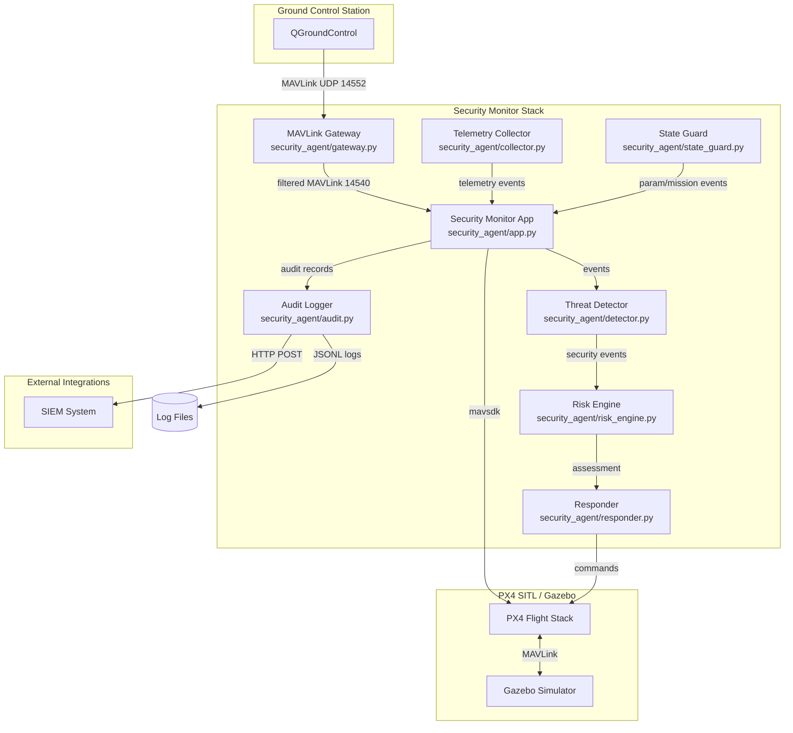

# Drone Security Simulation - Architecture

## System Overview



## Data Flow

### 1. Telemetry Flow
```
PX4 → MAVSDK (mavsdk) → TelemetryCollector → Event Queue → SecurityMonitorApp → AuditLogger
```

### 2. Command Flow (with Gateway)
```
QGroundControl → MAVLinkGateway (filtering/encryption) → PX4
PX4 → MAVLinkGateway → QGroundControl
```

### 3. Threat Detection Flow
```
Event (Telemetry/Command/Mission) → ThreatDetector.analyze()
  → SecurityEvent[] → RiskEngine.assess() → RiskAssessment
  → Responder.execute() → (optional) Active Response on PX4
```

### 4. Audit Flow
```
All Events → AuditLogger
  → JSONL files (telemetry.jsonl, security_events.jsonl, protocol_events.jsonl)
  → SHA-256 hash chain for integrity
  → (optional) HTTP POST to SIEM
```

## Component Responsibilities

| Component | File | Responsibility |
|-----------|------|----------------|
| SecurityMonitorApp | app.py | Orchestrates all components, main event loop |
| TelemetryCollector | collector.py | Collects telemetry via MAVSDK |
| ThreatDetector | detector.py | Analyzes events for security threats |
| RiskEngine | risk_engine.py | Calculates risk scores, recommends actions |
| Responder | responder.py | Executes automated responses |
| StateGuard | state_guard.py | Monitors params/mission for changes |
| AuditLogger | audit.py | Logs events with hash chain |
| MavlinkGateway | gateway.py | Filters/encrypts MAVLink traffic |
| GatewayControl | config.py | Runtime gateway control interface |
| GatewaySettings | config.py | Gateway configuration |
| SecuritySettings | config.py | Security monitor settings |

## Port Configuration

| Port | Direction | Description |
|------|-----------|-------------|
| 14540 | Gateway → PX4 | Upstream MAVLink (API) |
| 14541 | Client → Gateway | Gateway client port (API) |
| 14550 | Gateway → GCS | Upstream MAVLink (GCS) |
| 14552 | GCS → Gateway | Gateway GCS client port |

## Security Features

1. **MAVLink Gateway Filtering**
   - Block param writes, mission writes, serial control
   - Block specific command IDs
   - Authorized client host filtering

2. **Optional AES-GCM Encryption**
   - Encrypt MAVLink datagrams between clients and gateway
   - Authenticated encrypted datagram (DSEC2) with operator auth

3. **Threat Detection**
   - Param change detection (critical params monitoring)
   - Mission plan change detection
   - Navigation excursion detection
   - Attack scenario emulation

4. **Audit Integrity**
   - SHA-256 hash chain in JSONL logs
   - `audit_hash` and `audit_prev_hash` in each record
   - Verifiable with `tools/verify_audit_log.py`

5. **Risk-Based Response**
   - LOW/MEDIUM/HIGH/CRITICAL risk levels
   - Actions: LOG, ALERT, NOTIFY, TERMINATE, LOCKDOWN
   - Active response mode available
